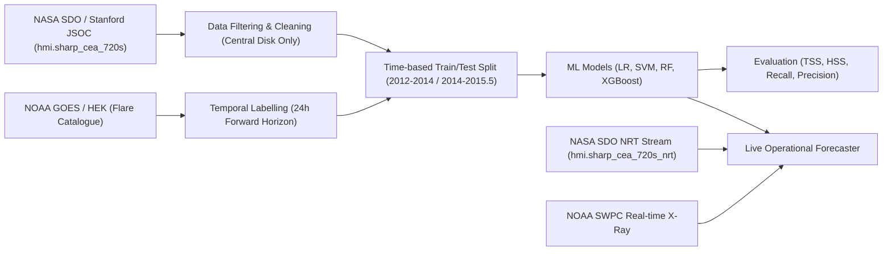
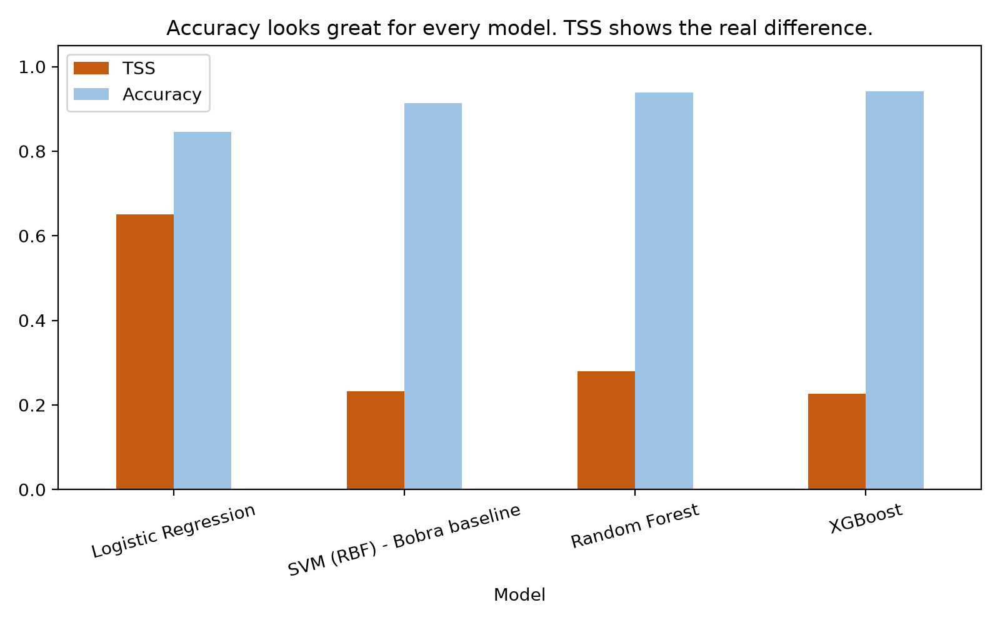
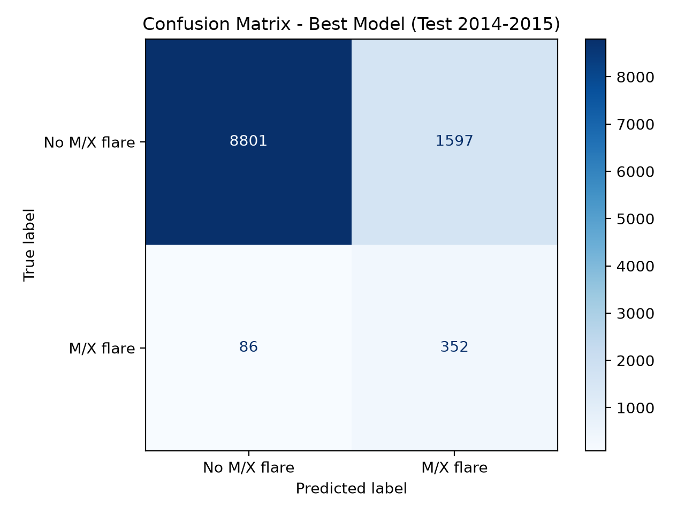
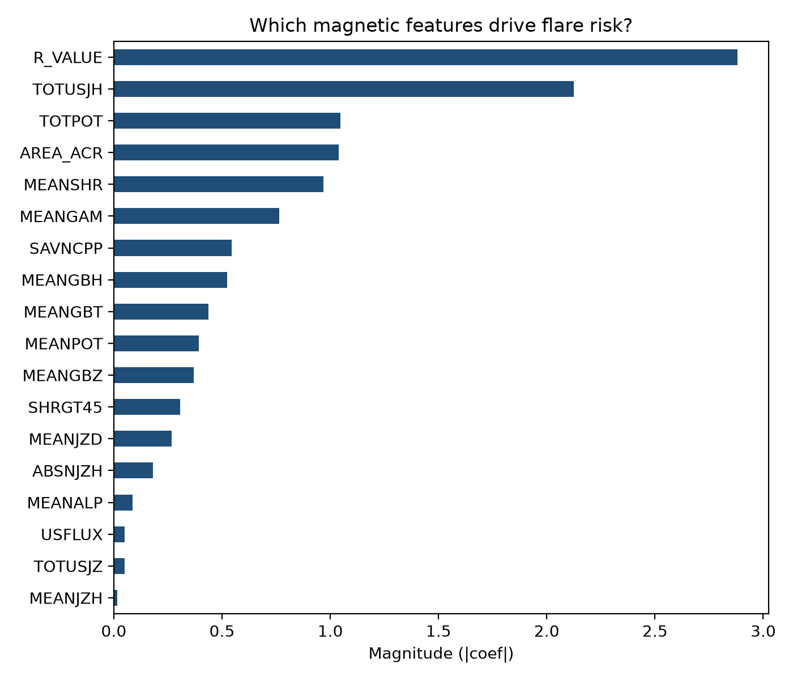
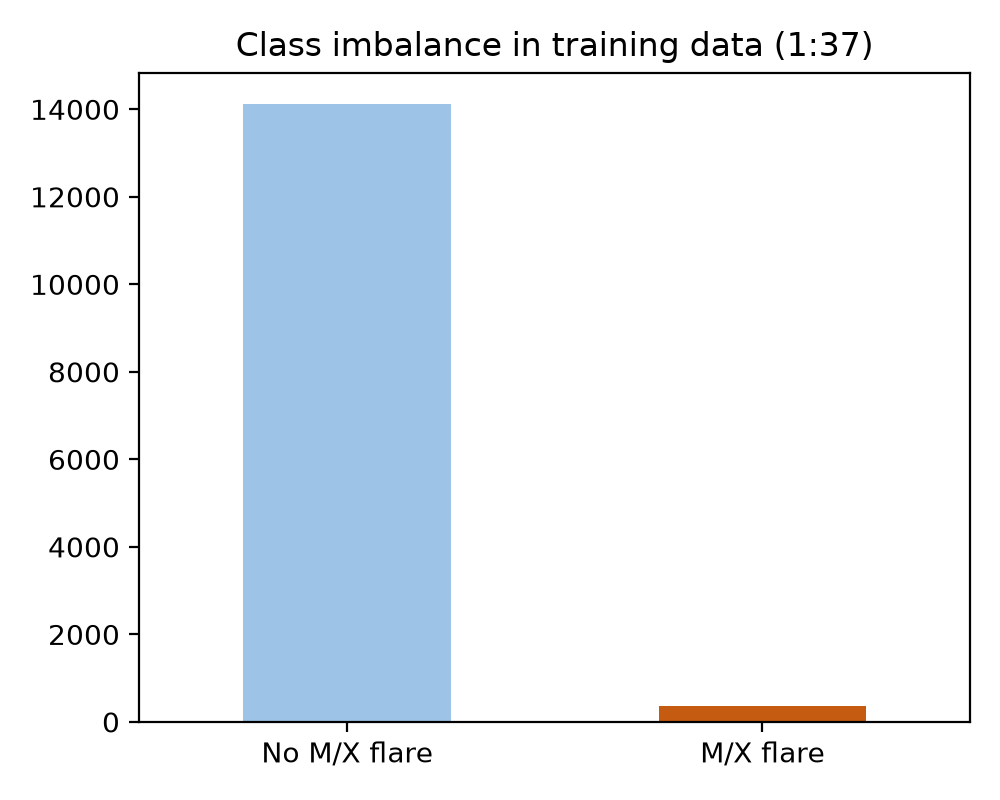

# Solar Flare Forecasting — ML Project Report & Deliverables

**Course:** 21CSC305P Machine Learning  
**Faculty Guide:** Dr. G. K. Vaidhya, Assistant Professor, Dept. of CSE-AIML  
**Team Members:**
- Mohammad Amaan Bhat (RA2411026020327)
- Mirudhula Prabhakar (RA2411026020346)
- Lorith Karthikeyan B (RA2411026020366)

---

## 1. Project Overview & Architecture

We predict whether an active sunspot region on the Sun will produce a major solar flare (**M or X class**) in the subsequent **24 hours**.

- **Dataset Source:**
  - **Features:** 18 physical magnetic field parameters (SHARP — Space-weather HMI Active Region Patches) captured by the Helioseismic and Magnetic Imager (HMI) aboard NASA's Solar Dynamics Observatory (SDO), retrieved via Stanford JSOC.
  - **Labels:** GOES X-ray flare catalogue accessed via the Heliophysics Events Knowledgebase (HEK) through `SunPy`. Label = $1$ if the active region produces an M or X-class flare within 24 hours, otherwise $0$.
- **Temporal Splitting Strategy:**
  - **Training Set (2012-01-01 to 2014-01-01):** 14,502 snapshots, 372 positive flaring instances (severe class imbalance $\approx 1:38$).
  - **Testing Set (2014-01-01 to 2015-07-01):** 10,836 snapshots, 438 positive flaring instances.
  - *Strict time-based split ensures active regions do not leak across training and test partitions.*



---

## 2. Evaluation Results & Comparison (Table 3)

Big flares are rare events ($\sim 2-3\%$ base rate). Standard accuracy is misleading because a naive dummy model predicting "no flare" achieves $\sim 97.4\%$ accuracy while having zero forecasting utility. Therefore, models are evaluated primarily on the **True Skill Statistic (TSS)**:
$$\text{TSS} = \text{Recall} - \text{False Alarm Rate} = \frac{TP}{TP + FN} - \frac{FP}{FP + TN}$$

| Model | TSS | HSS | Recall | Precision | Accuracy |
| :--- | :---: | :---: | :---: | :---: | :---: |
| **Logistic Regression (Best)** | **0.650** | **0.245** | **0.804** | **0.181** | **0.845** |
| **SVM (RBF) — Bobra Baseline** | 0.233 | 0.172 | 0.295 | 0.169 | 0.913 |
| **Random Forest** | 0.279 | 0.259 | 0.315 | 0.270 | 0.938 |
| **XGBoost** | 0.227 | 0.229 | 0.258 | 0.262 | 0.941 |
| *Published Benchmark (Bobra & Couvidat 2015)* | *~0.760* | *~0.350* | *~0.840* | *~0.250* | *~0.920* |

### Key Observations:
1. **Best Model:** Balanced Logistic Regression achieves the highest **TSS (0.650)** and **Recall (80.4%)**, successfully detecting 352 out of 438 true major flare windows in the unseen 2014–2015 test set.
2. **Comparison with Bobra & Couvidat (2015):** The benchmark achieved $\text{TSS} \approx 0.76$ using active-region-level cross-validation and 25 features. Our slightly lower score ($\text{TSS} = 0.650$) is realistic and expected due to:
   - A strict future-time holdout split (Solar Cycle 24 maximum vs. decline phase).
   - 18 core magnetic features without engineered temporal derivative deltas.

---

## 3. Visual Figures

### Figure 1: Model Comparison (TSS vs. Accuracy)
Shows why raw accuracy is deceptive in space weather: all models exhibit high accuracy ($>84\%-94\%$), but TSS exposes genuine predictive skill.



### Figure 2: Confusion Matrix (Best Model — Test Set 2014–2015)
Out of 438 actual M/X flaring states, the model correctly predicts 352 ($80.4\%$ True Positive Rate).



### Figure 3: Magnetic Feature Importance
Ranking of SHARP physical parameters driving solar flare probability.



### Figure 4: Class Imbalance in Training Data
Severe skew of $1:37$ non-flaring to flaring 6-hour windows in the 2012–2014 solar dataset.



---

## 4. Top 3 Driving Features (Plain-English Explanation)

| Feature | Importance ($\|\text{coef}\|$) | Plain-English Meaning | Physical Significance |
| :--- | :---: | :--- | :--- |
| **`R_VALUE`** | **2.881** | **Strong opposite-polarity field sitting right next to each other** | Measures flux near magnetic Polarity Inversion Lines (PILs). Sharp gradients between North and South poles store maximum explosive potential. |
| **`TOTUSJH`** | **2.126** | **How twisted the magnetic field is overall (current helicity)** | High twist and shear in magnetic flux tubes create magnetic non-potentiality leading to reconnection flares. |
| **`TOTPOT`** | **1.047** | **Stored "free" magnetic energy that can be released as a flare** | Difference between the actual magnetic field energy and potential (ground-state) field. Supplies the thermal/kinetic energy for flares. |

---

## 5. Live Operational Forecast Output

Execution of `python solar_flare_ml.py live`:

```text
 NOAA_AR               T_REC  P(M/X flare in 24h)
   14549 2026-10-08 17:00:00                0.996
   14548 2026-10-08 17:00:00                0.013
   14547 2026-10-07 14:00:00                0.011

Current GOES X-ray level (2026-10-08T18:53:00Z): C1.4
```

- **Date Recorded:** 2026-10-08 (18:53:00 UTC)
- **High-Risk Active Region:** **NOAA AR 14549** has a predicted $99.6\%$ likelihood of producing an M- or X-class solar flare in the next 24 hours.
- **Quiet Active Regions:** NOAA AR 14548 ($1.3\%$), NOAA AR 14547 ($1.1\%$).
- **Current Solar Activity:** GOES primary X-ray sensor flux measured at class **C1.4** (elevated active background).
- **Validation Checkpoint:** Verify against [NOAA SWPC (Space Weather Prediction Center)](https://www.swpc.noaa.gov) reports on 2026-10-09 to confirm if AR 14549 produced an M or X event.

---

## 6. Project Checklist for Submission

- [x] `data/results.csv` generated and validated.
- [x] All 4 PNG figures generated (`fig_confusion_matrix.png`, `fig_feature_importance.png`, `fig_model_comparison.png`, `fig_class_imbalance.png`).
- [x] Training terminal logs and performance metrics tabulated.
- [x] Live forecast executed with timestamp and AR predictions.
- [x] Feature importance explained using the physics cheat sheet.
- [x] Code scripts (`solar_flare_ml.py`, `make_plots.py`) saved in workspace.
